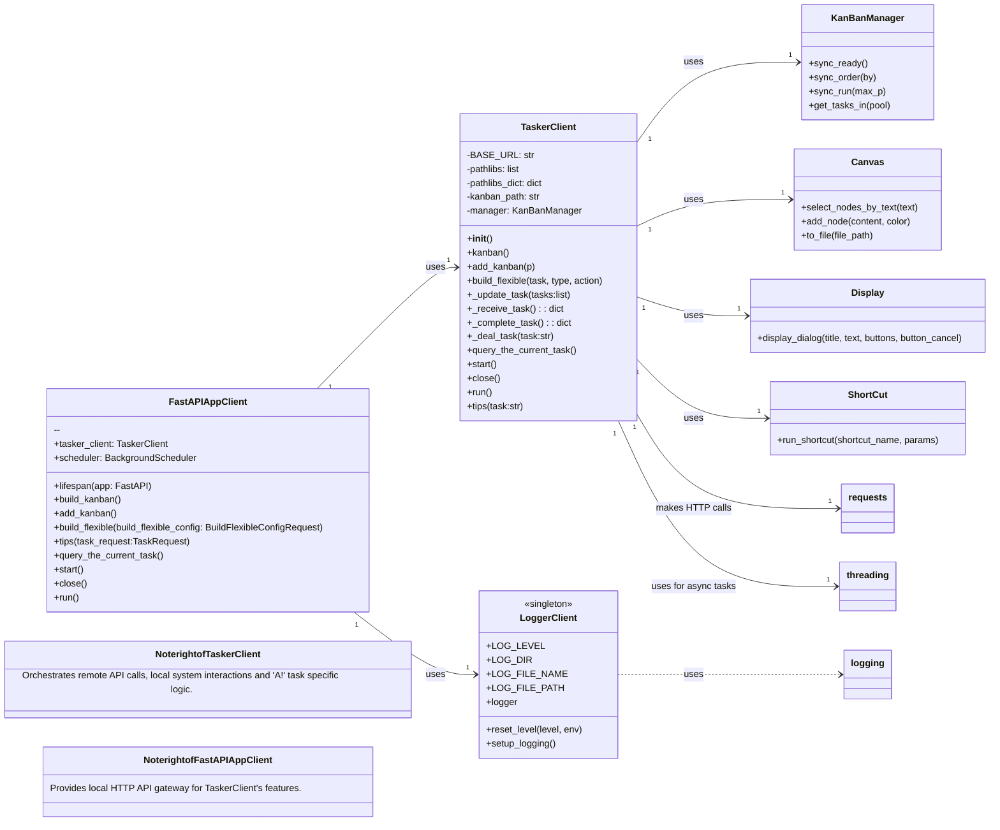

# Taskerz 任务管理系统 LLD V1.0

## 1. 项目概述

本 LLD 详细描述 Taskerz 任务管理系统的低层设计，包括服务端 (`taskerz`) 和客户端 (`tasker_client_mac`) 的内部结构、模块交互、核心算法及接口定义。

## 2. 服务端 (`taskerz`) 详细设计

### 2.1 模块结构与职责

*   **`src/taskerz/abstra.py`**: 定义抽象基类 `TaskExecutionStrategy` (策略模式接口) 和 `TaskState` (状态模式接口)。
*   **`src/taskerz/execution_strategy.py`**: 包含具体任务执行策略的实现。当前主要为 `PromptTaskExecutionStrategy` (人工提示型任务)。未来可扩展 `ScriptTaskExecutionStrategy` (脚本执行型任务)。
*   **`src/taskerz/task_state.py`**: 包含具体任务状态的实现，如 `TodoState` (待办)、`InProgressState` (进行中)、`CompletedState` (完成)、`FailedState` (失败)。每个状态定义了 `handle` (获取提示) 和 `complete` (推进状态) 方法。
*   **`src/taskerz/task_manager.py`**: **核心任务管理模块**。
    *   维护一个任务队列 (`_tasks_order`: 列表，保持任务顺序) 和任务字典 (`_tasks`: 字典，通过名称快速查找任务)。
    *   支持 `Task` (老版，无 `belong` 字段) 和 `Task_new` (新版，带 `belong` 字段，支持多用户/配置隔离)。
    *   提供任务的添加 (`add_task`, `add_task_new`)、查询当前顺序任务 (`get_current_sequential_task`, `get_current_sequential_task_new`)、完成当前任务 (`complete_current_task`, `complete_current_task_new`)、以及获取所有任务状态 (`get_task_list`, `get_task_list_new`) 等方法。
    *   通过 `clear()` 方法清空所有任务。
*   **`src/taskerz/workday_facade.py`**: **外观模式实现**。
    *   为外部模块（如 `server.py`, `cli.py`）提供简化、统一的任务操作接口。
    *   封装了与 `TaskManager` 的交互。
    *   负责从 YAML 配置文件 (`workday_tasks.yaml`, `workday_tasks_new.yaml`) 加载预设任务，并将其添加到 `TaskManager`。
    *   方法包括 `get_current_task_info` (获取当前任务信息)、`complete_current_task` (完成当前任务)、`_morning_tasks` (加载清晨任务) 等。
*   **`src/taskerz/server.py`**: **FastAPI 服务入口与定时调度**。
    *   基于 FastAPI 框架，暴露 RESTful API 接口，供客户端调用。
    *   使用 `APScheduler` (`BackgroundScheduler`) 实现定时任务调度，例如每日清空任务、定时加载周期性任务等。
    *   定义了 `/receive`, `/complete`, `/update_tasks`, `/list_tasks` 等核心 API 接口。
    *   支持 `dev` 和 `prod` 环境配置，包括日志级别和热重载。
*   **`src/taskerz/cli.py`**: 命令行接口工具。直接调用 `WorkdayFacade` 的方法，提供手动任务操作功能。
*   **`src/taskerz/log.py`**: 单例模式实现的日志模块，提供统一的日志记录功能，支持文件和控制台输出，可配置日志级别和轮转。

### 2.2 UML 设计

```mermaid
classDiagram
    direction LR

    class TaskExecutionStrategy{
        <<abstract>>
        +execute(task_context)
    }

    class PromptTaskExecutionStrategy{
        +execute(task_context)
    }

    class TaskState{
        <<abstract>>
        +handle(task_context)
        +complete(task_context)
        +get_status()
    }

    class TodoState{
        +handle(task_context)
        +complete(task_context)
        +get_status()
    }

    class InProgressState{
        +handle(task_context)
        +complete(task_context)
        +get_status()
    }

    class CompletedState{
        +handle(task_context)
        +complete(task_context)
        +get_status()
    }

    class FailedState{
        +handle(task_context)
        +complete(task_context)
        +get_status()
    }

    class Task{
        -name: str
        -script_code: str
        -_state: TaskState
        -execution_strategy: TaskExecutionStrategy
        +set_state(state: TaskState)
        +request()
        +complete_task()
        +get_status()
    }
    
    class Task_new{
        -name: str
        -belong: str
        -_state: TaskState
        -execution_strategy: TaskExecutionStrategy
        +set_state(state: TaskState)
        +request()
        +complete_task()
        +get_status()
        +__eq__(other)
        +__hash__()
    }

    class TaskManager{
        -_tasks_order: list
        -_tasks: dict
        +clear()
        +clear_new()
        +add_task(task_name, task_type, script_code)
        +add_task_new(task_info)
        +get_task(task_name)
        +get_current_sequential_task()
        +get_current_sequential_task_new(id)
        +complete_current_task()
        +complete_current_task_new(id)
        +get_task_status(task_name)
        +get_task_status_new(task)
        +get_task_list()
        +get_task_list_new(id)
    }

    class WorkdayFacade{
        +clear()
        +clear_new()
        +_load_tasks_from_yaml(section)
        +_load_tasks_from_yaml_new(section, id)
        +_add_tasks_from_yaml(section, label)
        +_add_tasks_from_yaml_new(section, label, id)
        +_morning_tasks()
        +_morning_tasks_new(id)
        +_start_work_tasks()
        +_finish_work_tasks()
        +_evening_tasks()
        +_rest()
        +add_person_tasks(tasks)
        +add_person_tasks_new(tasks)
        +get_current_task_info()
        +get_current_task_info_new(id)
        +complete_current_task()
        +complete_current_task_new(id)
        +get_all_tasks_status()
        +get_all_tasks_status_new(id)
    }

    class FastAPIAppTaskerzServer{
        +lifespan(app: FastAPI)
        +task_daily_midnight()
        +task_weekday_3am()
        +task_weekday_850am()
        +task_weekday_6pm()
        +task_weekday_7pm()
        +task_weekend_8am()
        +adapter(text)
        +receive()
        +receive_new(id:str)
        +complete()
        +complete_new(id:str)
        +update_tasks(task_request:TaskListRequest)
        +update_tasks_new(task_request:TaskListJSONRequest)
        +list_tasks()
        +list_tasks_new(id)
        +morning()
        +morning_new(id:str)
        +clear()
        +clear_new()
        --
        +workday_facade: WorkdayFacade
        +scheduler: BackgroundScheduler
    }

    class CLITaskerzServer{
        +receive_task()
        +receive_task_new(id:str)
        +complete_task()
        +complete_task_new(id:str)
        +list_all_tasks()
        +list_all_tasks_new(id:str)
        +show_help()
        +main()
    }
    
    class Logger{
        <<singleton>>
        +LOG_LEVEL
        +LOG_DIR
        +LOG_FILE_NAME
        +LOG_FILE_PATH
        +logger
        +reset_level(level, env)
        +setup_logging()
    }

    TaskExecutionStrategy <|-- PromptTaskExecutionStrategy
    TaskState <|-- TodoState
    TaskState <|-- InProgressState
    TaskState <|-- CompletedState
    TaskState <|-- FailedState

    Task "1" *-- "1" TaskState : uses
    Task "1" *-- "1" TaskExecutionStrategy : uses
    Task_new "1" *-- "1" TaskState : uses
    Task_new "1" *-- "1" TaskExecutionStrategy : uses

    TaskManager "1" *-- "0..*" Task : manages
    TaskManager "1" *-- "0..*" Task_new : manages

    WorkdayFacade "1" --> "1" TaskManager : uses
    FastAPIAppTaskerzServer "1" --> "1" WorkdayFacade : uses
    CLITaskerzServer "1" --> "1" WorkdayFacade : uses
    FastAPIAppTaskerzServer "1" --> "1" Logger : uses
    CLITaskerzServer "1" --> "1" Logger : uses
    
    Logger ..> logging : uses

    Note right of TaskManager: Core component for managing task lifecycle and state.
    Note right of WorkdayFacade: Simplifies interaction with TaskManager; handles YAML loading.
    Note right of FastAPIAppTaskerzServer: Main entry for external communication and scheduled tasks.
```

### 2.3 核心算法与逻辑

*   **任务状态机**: `Task` 类通过持有 `TaskState` 实例实现状态模式。`complete_task()` 方法将任务行为委托给当前状态的 `complete()` 方法，由状态对象决定是否进行状态转换。
    *   `TodoState.complete()`: 对于 `PromptTaskExecutionStrategy` 的任务，转换为 `InProgressState`。
    *   `InProgressState.complete()`: 对于 `PromptTaskExecutionStrategy` 的任务，转换为 `CompletedState`。
*   **任务顺序与获取**: `TaskManager` 使用 `_tasks_order` 列表维护任务的顺序。`get_current_sequential_task()` 方法遍历此列表，返回第一个非 `CompletedState` 的任务，确保任务按添加顺序依次处理。
*   **多用户/配置支持**: `Task_new` 类引入 `belong` 字段，配合 `workday_tasks_new.yaml` 的多层结构，以及 `TaskManager.get_current_sequential_task_new(id)` 和 `_add_tasks_from_yaml_new(section, label, id)` 等方法，初步实现了多用户/配置的任务隔离。

### 2.4 数据存储

*   当前版本：任务数据主要存储在 `TaskManager` 实例的内存中。
*   未来规划：考虑将任务数据持久化到文件（如 SQLite）或关系型数据库，以增强数据可靠性和可查询性。

### 2.5 API 接口设计 (服务端)

| 接口名称           | HTTP 方法 | 路径                      | 请求体示例                                                                            | 响应体示例                                                    | 描述                                                                                       |
| :----------------- | :-------- | :------------------------ | :------------------------------------------------------------------------------------ | :------------------------------------------------------------ | :----------------------------------------------------------------------------------------- |
| 获取当前任务       | GET       | `/receive`                | 无                                                                                    | `{"message": "当前任务：洗澡,刷牙 (待办)
提示: 请开始任务：洗澡,刷牙"}` | 获取当前（第一个未完成）任务的信息和提示。                                               |
| 获取指定用户当前任务 | GET       | `/receive_new/{id}`       | 无                                                                                    | `{"message": "当前任务：任务A (待办)
提示: 请开始任务：任务A"}` | 获取指定用户（由 `id` 标识）的当前任务信息和提示。                                         |
| 完成当前任务       | GET       | `/complete`               | 无                                                                                    | `{"message": "任务 '洗澡,刷牙' 状态更新为：进行中
---
所有任务已完成！"}` | 推进当前任务状态，并返回下一个任务信息。                                                   |
| 完成指定用户当前任务 | GET       | `/complete_new/{id}`      | 无                                                                                    | `{"message": "任务 '任务B' 已标记为：完成
---
当前任务：任务C (待办)..."}` | 推进指定用户当前任务状态，并返回下一个任务信息。                                           |
| 更新/添加任务      | POST      | `/update_tasks`           | `{"tasks": ["任务1 (人工)", "任务2 (人工)"]}`                                         | `{"message": "人工任务示例已添加"}`                             | 批量添加任务，旧版接口。                                                                   |
| 更新/添加任务 (新) | POST      | `/update_tasks_new`       | `{"tasks": [{"content": "学习Python", "belong": "user_a"}, {"content": "写文档", "belong": "user_a"}]}` | `{"message": "人工任务示例已添加"}`                             | 批量添加任务，支持指定 `belong` 字段。                                                     |
| 列出所有任务       | GET       | `/list_tasks`             | 无                                                                                    | `{"message": "
--- 所有任务状态 ---
- 洗澡,刷牙: 任务 '洗澡,刷牙' 的状态是：待办
..."}` | 列出所有任务及其状态。                                                                     |
| 列出指定用户所有任务 | GET       | `/list_tasks_new/{id}`    | 无                                                                                    | `{"message": "
--- 所有任务状态 ---
- 任务A: 任务 '任务A' 的状态是：完成
..."}` | 列出指定用户所有任务及其状态。                                                             |
| 加载清晨任务       | GET       | `/morning`                | 无                                                                                    | `{"message": "FastAPI and APScheduler configured."}`         | 手动触发加载预设清晨任务。                                                                 |
| 加载指定用户清晨任务 | GET       | `/morning_new/{id}`       | 无                                                                                    | `{"message": "FastAPI and APScheduler configured."}`         | 手动触发加载指定用户预设清晨任务。                                                         |
| 清空所有任务       | GET       | `/clear`                  | 无                                                                                    | `{"message": "FastAPI and APScheduler configured."}`         | 清空所有任务。                                                                             |
| 清空指定用户所有任务 | GET       | `/clear_new`              | 无                                                                                    | `{"message": "FastAPI and APScheduler configured."}`         | 清空指定用户所有任务。                                                                     |

## 3. 客户端 (`tasker_client_mac`) 详细设计

### 3.1 模块结构与职责

*   **`src/tasker_client_mac/core.py`**: **核心业务逻辑与编排模块**。
    *   `TaskerClient` 类：
        *   **远程通信**: 封装了与 `taskerz` 服务端 API 的 HTTP 交互 (`_receive_task`, `_complete_task`, `_update_task`)。
        *   **任务分发**: `start()`, `run()` 等方法根据从服务端获取的任务信息，判断任务类型（`A!` 或普通提醒），并调用 `_deal_task()` 进行差异化处理。
        *   **`_deal_task()` 核心逻辑**: 这是客户端最复杂的编排部分。它根据 `A!` 标记解析任务，并调度与本地应用和 macOS 服务的交互：
            *   调用 `appscriptz.core.Display` 模块弹出系统对话框。
            *   调用 `appscriptz.core.ShortCut` 模块执行 macOS 快捷指令（用于 Session 计时、进度备注等）。
            *   调用 `kanbanz.manager.KanBanManager` 管理本地 Obsidian 看板，进行任务的移动（执行池 -> 完成池）。
            *   调用 `canvaz.core.Canvas` 管理本地 Obsidian Canvas 文件，修改任务卡片内容和颜色。
            *   在单独的线程中执行耗时任务，避免阻塞主进程。
        *   **本地看板/Canvas 集成**: `kanban()`, `add_kanban()`, `tips()` 等方法处理 Obsidian 文件相关的逻辑。
        *   维护 `pathlibs_dict` 映射项目名称到 Canvas 文件路径。
    *   **外部依赖**: 依赖 `requests` (HTTP 请求)、`threading` (异步执行)、`kanbanz` (看板管理)、`canvaz` (Canvas 操作)、`appscriptz` (macOS 交互)。
*   **`src/tasker_client_mac/server.py`**: **本地 FastAPI 服务入口**。
    *   在本地机器上运行一个 FastAPI 实例，暴露 HTTP API 接口，允许其他本地应用或脚本调用 `TaskerClient` 的功能。
    *   使用 `APScheduler` 实现定时任务，例如定时调用 `tasker_client_mac.kanban()` 来同步本地看板任务。
    *   提供 `/build_kanban`, `/add_kanban`, `/build_flexible`, `/tips`, `/receive`, `/start`, `/close`, `/run` 等接口。
*   **`src/tasker_client_mac/log.py`**: 单例模式实现的日志模块，与服务端日志模块设计一致，确保客户端日志统一管理。

### 3.2 UML 设计



### 3.3 核心算法与逻辑

*   **`A!` 任务解析**: `TaskerClient._deal_task()` 方法通过正则表达式或字符串分割，解析任务字符串以提取任务时长 (如 `2P` -> 40分钟)、任务名称、所属项目等信息。
*   **跨进程/应用通信**:
    *   通过 `requests` 库进行 HTTP API 调用与远程服务端通信。
    *   通过 `appscriptz` 库调用 macOS 的 `osascript` 接口执行 AppleScript 脚本，从而与 Session 应用进行交互（启动/停止计时）。
    *   通过 `appscriptz` 库调用 macOS 快捷指令。
    *   通过对 Obsidian 本地文件的直接操作 (`kanbanz`, `canvaz`)，实现与 Obsidian 看板和 Canvas 的集成。
*   **任务计时与反馈**: `task_with_time()` 辅助函数通过调用快捷指令启动计时，`failed_safe()` 确保计时结束。用户交互通过 `display_dialog` 实现，并使用 `run_shortcut` 获取用户输入的进度备注。
*   **Canvas 节点颜色管理**: 根据任务的完成状态和用户选择，更新 Canvas 节点颜色（`"4"` 完成，`"3"` 待定/黄色，`"0"` 未解决/灰色）。

### 3.4 API 接口设计 (客户端)

| 接口名称         | HTTP 方法 | 路径                 | 请求体示例                                             | 响应体示例                                                | 描述                                                           |
| :--------------- | :-------- | :------------------- | :----------------------------------------------------- | :-------------------------------------------------------- | :------------------------------------------------------------- |
| 构建看板任务     | GET       | `/build_kanban`      | 无                                                     | `{"message": "successed build"}`                          | 自动同步 Obsidian 看板任务，并更新到服务端。                 |
| 添加看板任务     | GET       | `/add_kanban`        | 无                                                     | `{"message": "successed build"}`                          | 手动同步 Obsidian 看板任务（带优先级），并更新到服务端。     |
| 灵活构建任务     | POST      | `/build_flexible`    | `{"task": "新任务", "type": "flex", "action": true}` | `{"message": "successed build"}`                          | 灵活添加指定任务或从特定池任务，并更新到服务端。               |
| 添加本地提示/备注 | POST      | `/tips`              | `{"task": "delay:proj:ques:detail"}`                 | `{"message": "以添加"}`                                   | 在本地 Obsidian Canvas 文件中添加带分类和颜色的提示/备注。   |
| 查询当前任务     | GET       | `/receive`           | 无                                                     | `{"message": "当前任务：A!2P XX (待办)"}`                | 从服务端获取当前任务信息并返回。                               |
| 启动任务         | GET       | `/start`             | 无                                                     | `{"message": "task: A!2P XX (待办) 进行中"}`             | 启动当前待办任务，如果是 `A!` 任务则触发本地自动化流程。     |
| 关闭任务         | GET       | `/close`             | 无                                                     | `{"message": "task: A!2P YY (进行中) 已完成"}`            | 关闭当前进行中任务，触发本地清理并同步到服务端。               |
| 推进任务         | GET       | `/run`               | 无                                                     | `{"message": "任务 'ZZ' 状态更新为：进行中
---
所有任务已完成！"}` | 推进当前任务状态，对于 `A!` 任务会触发本地自动化，并同步状态。 |

## 4. 系统集成与协作

Taskerz 任务管理系统由独立部署的服务端和客户端组成，通过 HTTP API 进行通信，形成松耦合但逻辑紧密协作的分布式系统。

### 4.1 核心数据流

1.  **任务加载**:
    *   **服务端启动/定时触发**：从 `workday_tasks.yaml` 加载预设任务到 `taskerz` 服务端的 `TaskManager`。
    *   **客户端同步**: `tasker_client_mac` 定时或手动从本地 Obsidian 看板 (`kanbanz`) 读取任务，并通过 `POST /update_tasks_new` 将其发送到 `taskerz` 服务端。
2.  **任务执行与状态同步**:
    *   **查询**: `tasker_client_mac` 通过 `GET /receive` 向服务端查询当前待办任务。
    *   **启动/完成**:
        *   `tasker_client_mac` 用户启动任务后，根据任务类型：
            *   对于 `A!` 任务，`tasker_client_mac` 会在本地执行复杂的编排（计时、Obsidian 操作、macOS 快捷指令等）。
            *   无论是 `A!` 任务还是提醒任务，`tasker_client_mac` 都会通过 `GET /complete` 向 `taskerz` 服务端发送任务状态更新请求，推进任务状态。
        *   服务端接收到 `complete` 请求后，更新 `TaskManager` 中对应任务的状态。
3.  **本地交互与反馈**:
    *   `tasker_client_mac` 通过 `appscriptz` 模块与 macOS 系统进行交互（对话框、快捷指令）。
    *   `tasker_client_mac` 直接读写本地 Obsidian 文件（看板、Canvas），实现任务状态的本地可视化和备注。

### 4.2 模块间通信协议

*   **服务端与客户端**: 之间通过 **HTTP/RESTful API** 进行通信，JSON 作为数据交换格式。
*   **客户端内部**:
    *   `TaskerClient` 与 `FastAPIAppClient` (本地 FastAPI) 之间通过 Python 函数调用。
    *   `TaskerClient` 与 `requests`, `kanbanz`, `canvaz`, `appscriptz` 等第三方库之间通过各自的 Python API 进行调用。
    *   `_deal_task` 内部通过 `threading` 模块启动新线程，处理耗时或阻塞的本地交互，避免主线程卡顿。

## 5. 部署架构

*   **服务端 (`taskerz`)**: 部署在云端服务器，作为独立的 Python 进程运行，通过公网 IP 或域名提供 HTTP API 服务。
*   **客户端 (`tasker_client_mac`)**: 部署在本地 macOS 设备上，作为独立的 Python 进程运行。它可以手动启动，或配置为系统服务在后台运行。其内置的本地 FastAPI 服务监听本地端口，供其他本地应用或自动化脚本调用。

## 6. 测试策略

*   **单元测试**:
    *   **`taskerz`**: 重点测试 `TaskManager`、`TaskState`、`WorkdayFacade` 等核心业务逻辑模块，使用 `pytest` 和 `unittest.mock` 模拟外部依赖（如 YAML 文件加载）。
    *   **`tasker_client_mac`**: 重点测试 `TaskerClient` 中与外部系统交互的核心方法（特别是 `_deal_task`），大量使用 `unittest.mock` 模拟 `requests`、`kanbanz`、`canvaz`、`appscriptz` 等外部依赖。
*   **集成测试**:
    *   **服务端 API**: 使用 `pytest` 和 `httpx` (或 `requests`) 测试 `taskerz` 服务端的各个 RESTful API 接口，验证其功能和数据流。
    *   **客户端与服务端集成**: 模拟客户端行为，向真实运行的服务端发送请求，验证任务状态的端到端同步。
*   **系统测试**:
    *   在真实 macOS 环境中运行 `tasker_client_mac`，验证与 Session、Obsidian、快捷指令等本地应用的实际交互是否符合预期。
*   **端到端测试**: 验证从客户端发起任务操作，到服务端状态更新，再到客户端反馈的完整流程。

